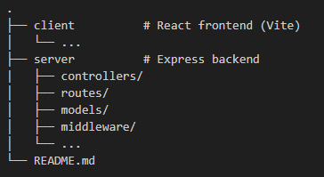

# 🛡️ Simple React + Express Authentication

A full-stack authentication system using React (frontend) and Express (backend) with JWT stored in HTTP-only cookies for secure, session-based login.

---

## 📦 Tech Stack

- Backend: Node.js, Express, MongoDB, Mongoose, JWT, bcrypt
- Frontend: React (Vite), Axios, TailwindCSS (optional)
- Authentication: JSON Web Tokens (JWT) in HTTP-only cookies

---

## 🚀 Getting Started

### Clone the repository
git clone https://github.com/Fenrir-qt/simple-auth-app.git
cd simple-auth-app

---

## ⚙️ Backend Setup (Express)

1. Navigate to backend folder:
cd server

2. Install dependencies:
npm install

3. Create `.env` file:
PORT=3000
MONGO_URI=your_mongo_connection_string
JWT_SECRET=your_jwt_secret_key
NODE_ENV=development

4. Run the server:
nodemon server.js

Server runs on http://localhost:3000

---

## 💻 Frontend Setup (React)

1. Navigate to frontend folder:
cd client

2. Install dependencies:
npm install

3. Start the dev server:
npm run dev

Frontend runs on http://localhost:5173

---

## Note:

To access the authentication app, you only need to visit http://localhost:5173, which is the frontend (React) application.
The http://localhost:3000 address is used internally by the frontend to communicate with the backend server (Express) via API requests.

## 🔐 Features

- User Registration
- User Login (by username or email)
- JWT stored in HTTP-only cookies
- Logout (clears cookie)
- Protected routes (server-side with middleware)
- Axios with withCredentials for cookie-based auth

---

## 🧪 API Endpoints

| Method | Endpoint             | Description                 |
|--------|----------------------|-----------------------------|
| POST   | /api/auth/register   | Register a new user         |
| POST   | /api/auth/login      | Login with credentials      |
| POST   | /api/auth/logout     | Logout and clear the cookie |
| GET    | /api/protected       | Access a protected route    |

---

## 🛡️ Security Notes

- Cookies are set with:
  - httpOnly: true – prevents JS access
  - secure: true – in production only
  - sameSite: Lax or None – depending on cross-origin setup
- Passwords are securely hashed using bcrypt
- JWT expires after 1 hour by default

---

## 🧱 Folder Structure

